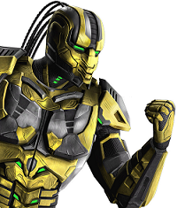

#  *Team 'Cyrax'*
# ScubaDiver
This game was created as part of the teamwork assignment for the course C# OOP (June 2016) at Telerik Academy by Team 'Cyrax'. Unity 3D game development platform was used throughout the process. Please find further information below.

## Team Members
The following team members were randomly chosen to participate in the team project assignment as **Team 'Cyrax'**:

| Name             | *Username*           |
| -----------------| ---------------------|
| Viliana Zhilkova | *Viliana_Zhilkova*   |
| Dilyana Komitova | *DilyanaKom*         |
| Dragomir Petrov  | *DragomirPetrov*     |
| Kiril Peyanski   | *kikopeyanski*       |
| Lazar Tsaprev    | *Tsaprev*            |
| Milen Tanev      | *Milen_Tanev*        |
| Milena Sapunova  | *milena.aleksandrova*|

## Project Purpose:
Following a team meeting, all team members agreed to fulfill the team project requirements by creating a scuba diver game. The player controls a scuba diver, who swims on the bottom of the ocean, by pressing either the arrow keys or WASD keys. In addition, the player is able to shoot at enemies, by using the space bar. The main goal of scuba diver is to shoot or avoid enemies, which are randomly generated sea creatures (fish, squid, piranhas, etc.). The upper-left corner displays the health bar and in the middle one can see the his progress in the game. If the scuba diver survives, he meets the boss for a final battle.

## Class diagram

## URL to repository
[**Link to GitHub repository**](https://github.com/TeamCyrax/ScubaDiverGame)
